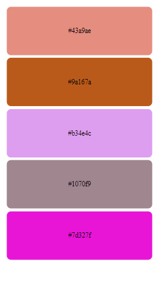
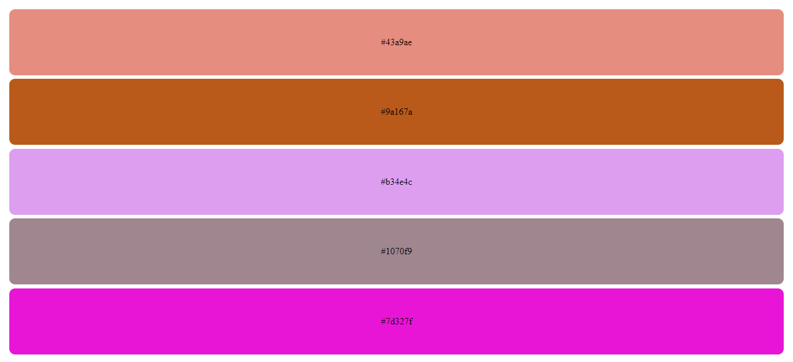

# 30 days of React. Day 04

## Table of contents

- [Overview](#overview)
  - [The challenge](#the-challenge)
  - [Screenshot](#screenshot)
  - [Links](#links)
- [My process](#my-process)
  - [Built with](#built-with)
  - [What I learned](#what-i-learned)
- [Author](#author)


## Overview

### The challenge
- Create a  hexadecimal color generator  to create these random colors
### Screenshot





### Links

- Solution URL: (https://github.com/ibimina/my-app-three)
- Live Site URL:(https://ibimina.github.io/my-app-three/)

## My process
- import react from React
- import reactdom from react-dom/client
- import css to be used for the project
- created function to generate hexadecimal color
- created an App component and set the div background color to the   hexadecimal color function

```jsx
function App() {

  return (
    <div className="App">
      <div style={{ backgroundColor: hexaColor() }} className="first">
        {hexaColor()}
      </div>

    </div>
  );
}
```
- renedered the app component in the DOM

### Built with

- JSX
- CSS custom properties
- Flexbox
- Mobile-first workflow


### What I learned

- I learnt how to set background color to a function

## Author

- Ibimina Hart
- Frontendmentor -(https://www.frontendmentor.io/ibimina)
- Twitter -(https://www.twitter.com/ibiminaaH)
